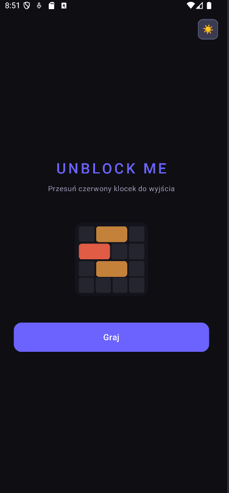
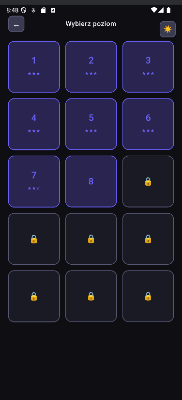
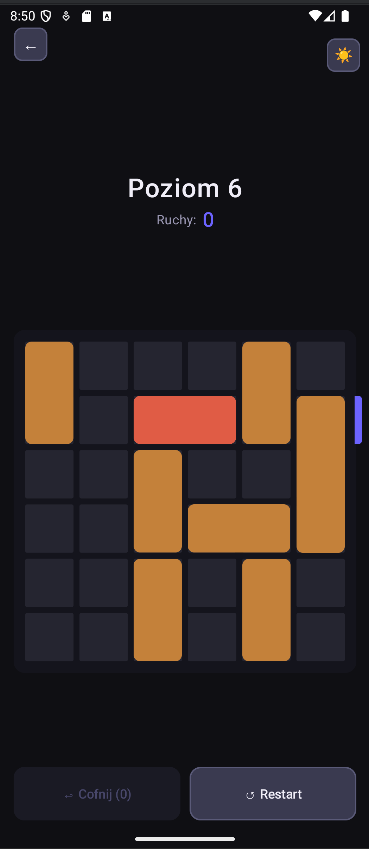

# Unblock Me - Jetpack Compose Game 🧩

A modern Android implementation of the classic "Unblock Me" puzzle game, built entirely with **Kotlin** and **Jetpack Compose**.

This project was created to demonstrate proficiency in building complex UIs, handling custom drag gestures, and implementing clean architecture patterns in a modern Android application.

## 📸 Screenshots

  
  
   

## 🚀 Tech Stack & Architecture

* **UI:** Jetpack Compose (Material Design 3, custom `Canvas` drawing, Pointer Input for gestures)
* **Architecture:** MVVM (Model-View-ViewModel) with Unidirectional Data Flow (UDF)
* **State Management:** `StateFlow` & Kotlin Coroutines
* **Data Handling:** JSON parsing from assets & `SharedPreferences` for persistent progress tracking

## 🧠 Key Features

* Custom grid physics and collision detection for block movements.
* Dynamic state hoisting ensuring UI survives recompositions.
* Persistent game progress (saving unlocked levels and optimal move star ratings).
* System-independent Dark and Light mode toggle.

## 🛠️ How to run

1. Clone this repository.
2. Open the project in the latest version of **Android Studio**.
3. Sync Gradle and run the app on an emulator or a physical device (Minimum SDK: 26).